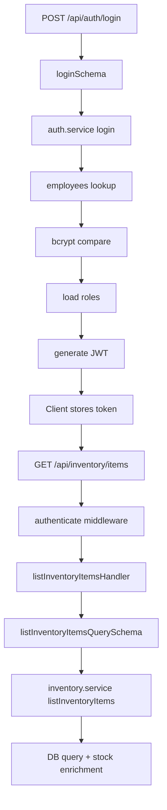
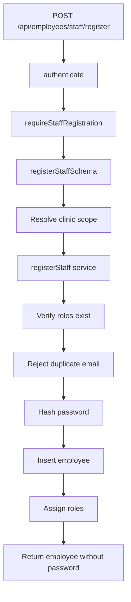
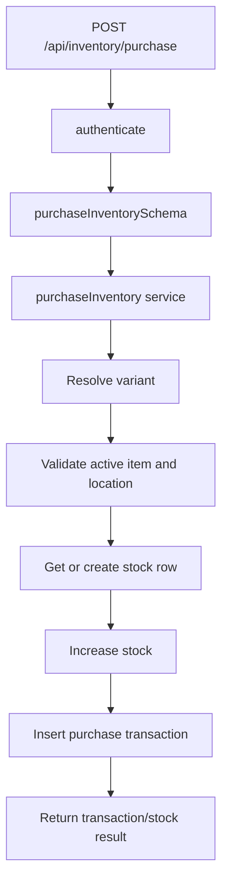
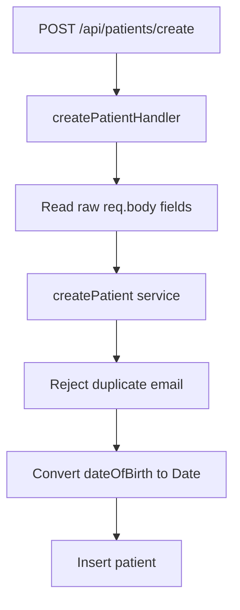

# Backend Flow Structure Report

Generated from the current backend codebase on 2026-06-07.

## 1. Application Entry Flow

### Runtime

- Server entry: `src/server.ts`
- Express app: `src/app.ts`
- Database client: `src/db/client.ts`
- ORM: Drizzle ORM over PostgreSQL using `pg`
- Validation library: Zod
- Auth: JWT bearer token in the `Authorization` header

### Boot sequence

1. `src/server.ts` loads environment variables via `dotenv/config`.
2. It imports `app` from `src/app.ts`.
3. It listens on `process.env.PORT` or `4000`.
4. `src/db/client.ts` requires `DATABASE_URL`; if missing, startup fails when the DB client module is loaded.
5. Drizzle is initialized with a PostgreSQL pool and SSL enabled with `rejectUnauthorized: false`.

### Express middleware and mounted APIs

`src/app.ts` configures:

- CORS for `http://localhost:5173`
- JSON body parsing via `express.json()`
- `GET /health`

Mounted route groups:

| Base path | Route file | Mounted |
|---|---|---|
| `/api/auth` | `src/modules/auth/auth.routes.ts` | Yes |
| `/api/employees` | `src/modules/employees/employees.routes.ts` | Yes |
| `/api/clinics` | `src/modules/clinics/clinics.routes.ts` | Yes |
| `/api/patients` | `src/modules/patients/patients.routes.ts` | Yes |
| `/api/inventory` | `src/modules/inventory/inventory.routes.ts` | Yes |
| `/api/leads` | `src/modules/leads/leads.routes.ts` | No |

`leads.routes.ts` exists but is empty and is not mounted in `src/app.ts`.

## 2. Database Schema Layer

Schema files live in `src/db/schema`.

Current `src/db/schema/index.ts` exports only:

- `employees`
- `employeeRoleAssignments`
- `roles`
- `clinic`
- `superAdmins`

The following schema files exist but are not exported from `index.ts`:

- `appointments`
- `patients`
- `leads`
- `inventoryCategories`
- `inventoryItems`
- `inventoryVariants`
- `inventoryLocations`
- `inventoryStocks`
- `inventoryTransactions`

### Core schemas

#### `clinics`

File: `src/db/schema/clinic.ts`

| Column | Type / rule |
|---|---|
| `id` | UUID primary key, default random |
| `legacyClinicId` | integer, unique, nullable |
| `clinicName` | varchar(255), required |
| `clinicCode` | varchar(50), unique, required |
| `email` | varchar(255), nullable |
| `phone` | varchar(20), nullable |
| `address` | text, nullable |
| `city`, `state`, `country` | varchar(100), nullable |
| `pincode` | varchar(20), nullable |
| `isActive` | boolean, default true |
| `createdAt`, `updatedAt` | timestamp, default now |

#### `employees`

File: `src/db/schema/employees.ts`

| Column | Type / rule |
|---|---|
| `id` | UUID primary key, default random |
| `legacyId` | integer, unique, nullable |
| `clinicId` | UUID, references `clinics.id`, cascade delete, required |
| `name` | varchar(255), required |
| `email` | varchar(255), unique, required |
| `password` | varchar(255), required, stores bcrypt hash |
| `phone` | varchar(255), required, default empty string |
| `designation` | varchar(255), required |
| `timings` | varchar(255), nullable |
| `isBlocked` | boolean, default false |
| `isSuspended` | boolean, default false |
| `isActive` | boolean, default true |
| `lastLoginAt` | timestamp, nullable |
| `createdAt`, `updatedAt` | timestamp, default now |

#### `employeeRoles`

File: `src/db/schema/roles.ts`

| Column | Type / rule |
|---|---|
| `id` | UUID primary key, default random |
| `name` | varchar(255), unique, required |
| `description` | varchar(255), nullable |
| `createdAt`, `updatedAt` | timestamp, default now |

#### `employee_role_assignments`

File: `src/db/schema/employeeRoleAssignments.ts`

| Column | Type / rule |
|---|---|
| `id` | UUID primary key, default random |
| `employeeId` | UUID, references `employees.id`, cascade delete |
| `roleId` | UUID, references `employeeRoles.id`, cascade delete |
| `createdAt` | timestamp, default now |

Unique constraint:

- `(employeeId, roleId)`

#### `super_admins`

File: `src/db/schema/superAdmins.ts`

| Column | Type / rule |
|---|---|
| `id` | UUID primary key, default random |
| `name` | varchar(255), required |
| `email` | varchar(255), unique, required |
| `password` | varchar(255), required, stores bcrypt hash |
| `isBlocked` | boolean, default false |
| `isActive` | boolean, default true |
| `lastLoginAt` | timestamp, nullable |
| `createdAt`, `updatedAt` | timestamp, default now |

### Patient, lead, and appointment schemas

#### `patients`

File: `src/db/schema/patients.ts`

| Column | Type / rule |
|---|---|
| `id` | UUID primary key, default random |
| `name` | varchar(255), required |
| `email` | varchar(255), unique, required |
| `phone` | varchar(255), required |
| `gender` | varchar(255), required |
| `dateOfBirth` | timestamp, required |
| `address` | text, required |
| `emergencyContactName` | varchar(255), required |
| `emergencyContactPhone` | varchar(255), required |
| `emergencyContactRelation` | varchar(255), required |
| `clinicId` | UUID, references `clinics.id`, cascade delete |
| `allergies` | varchar(255) array |
| `currentMedications` | varchar(255) array |
| `chronicConditions` | varchar(255) array |
| `cheifComplaint` | text, required |
| `pregnancyStatus` | varchar(255), required |
| `isActive` | boolean, default true |
| `lastVisitAt` | timestamp, nullable |
| `isBlackListed` | boolean, default false |
| `blackListedReason` | text, nullable |
| `isPremiumMember` | boolean, default false |
| `createdAt`, `updatedAt` | timestamp, default now |

Enum declared:

- `pregnancy_status`: `"Not Applicable"`, `"Pregnant"`, `"Not Pregnant"`

The enum is declared but the table currently stores pregnancy status as `varchar`.

#### `leads`

File: `src/db/schema/leads.ts`

Enums:

- `lead_source`: `call`, `whatsapp`, `website`, `walk_in`, `referral`, `qr_self`
- `lead_status`: `new_query`, `appointment_booked`, `follow_up`, `clinic_visited`, `no_show`

| Column | Type / rule |
|---|---|
| `id` | UUID primary key, default random |
| `clinicId` | UUID, references `clinics.id`, restrict delete |
| `patientId` | UUID, references `patients.id`, set null on delete |
| `name` | varchar(255), required |
| `email` | varchar(255), nullable |
| `phone` | varchar(20), required |
| `source` | `lead_source`, required |
| `status` | `lead_status`, default `new_query` |
| `symptoms` | text, nullable |
| `notes` | text, nullable |
| `createdAt`, `updatedAt` | timestamp with timezone, default now |

#### `appointments`

File: `src/db/schema/appointments.ts`

Enum:

- `appointment_status`: `scheduled`, `completed`, `cancelled`, `no_show`

| Column | Type / rule |
|---|---|
| `id` | UUID primary key, default random |
| `clinicId` | UUID, references `clinics.id`, restrict delete |
| `employeeId` | UUID, references `employees.id`, set null on delete |
| `patientId` | UUID, references `patients.id`, set null on delete |
| `leadId` | UUID, references `leads.id`, set null on delete |
| `scheduledAt` | timestamp with timezone, required |
| `status` | `appointment_status`, default `scheduled` |
| `symptoms` | text, nullable |
| `createdAt`, `updatedAt` | timestamp with timezone, default now |

There are no appointment routes, controllers, services, or validations in the current backend.

### Inventory schemas

#### `inventory_category`

File: `src/db/schema/inventoryCategories.ts`

| Column | Type / rule |
|---|---|
| `id` | UUID primary key, default random |
| `name` | varchar(255), required |
| `description` | text, nullable |
| `parentCategoryId` | UUID, nullable |
| `isActive` | boolean, default true |
| `createdAt`, `updatedAt` | timestamp, default now |

Unique index:

- `name`

#### `inventory_item`

File: `src/db/schema/inventoryItems.ts`

| Column | Type / rule |
|---|---|
| `id` | UUID primary key, default random |
| `categoryId` | UUID, references `inventory_category.id`, cascade delete |
| `clinicId` | UUID, references `clinics.id`, cascade delete, nullable |
| `name` | varchar(255), required |
| `sku` | varchar(100), nullable |
| `unit` | varchar(50), nullable |
| `minimumStockLevel` | integer, default 0 |
| `description` | text, nullable |
| `isActive` | boolean, default true |
| `createdAt`, `updatedAt` | timestamp, default now |

`clinicId` nullable means an item can be global/warehouse-level.

#### `inventory_variant`

File: `src/db/schema/inventoryVariants.ts`

| Column | Type / rule |
|---|---|
| `id` | UUID primary key, default random |
| `inventoryItemId` | UUID, references `inventory_item.id`, cascade delete |
| `name` | varchar(255), required |
| `sku` | varchar(100), nullable |
| `isActive` | boolean, default true |
| `createdAt`, `updatedAt` | timestamp, default now |

Unique index:

- `(inventoryItemId, name)`

#### `inventory_location`

File: `src/db/schema/inventoryLocations.ts`

| Column | Type / rule |
|---|---|
| `id` | UUID primary key, default random |
| `name` | varchar(255), required |
| `type` | varchar(50), expected `clinic` or `warehouse` |
| `city` | varchar(100), nullable |
| `address` | varchar(500), nullable |
| `clinicId` | UUID, references `clinics.id`, set null on delete |
| `isActive` | boolean, default true |
| `createdAt`, `updatedAt` | timestamp, default now |

#### `inventory_stock`

File: `src/db/schema/inventoryStocks.ts`

| Column | Type / rule |
|---|---|
| `id` | UUID primary key, default random |
| `variantId` | UUID, references `inventory_variant.id`, cascade delete |
| `locationId` | UUID, references `inventory_location.id`, cascade delete |
| `inStock` | integer, default 0 |
| `reservedStock` | integer, default 0 |
| `requiredStock` | integer, default 0 |
| `updatedAt` | timestamp, default now |

Unique index:

- `(variantId, locationId)`

#### `inventory_transaction`

File: `src/db/schema/inventoryTransactions.ts`

| Column | Type / rule |
|---|---|
| `id` | UUID primary key, default random |
| `variantId` | UUID, references `inventory_variant.id` |
| `fromLocationId` | UUID, references `inventory_location.id`, nullable |
| `toLocationId` | UUID, references `inventory_location.id`, nullable |
| `quantity` | integer, required |
| `transactionType` | varchar(50), required |
| `referenceNumber` | varchar(100), nullable |
| `notes` | text, nullable |
| `createdAt` | timestamp, default now |

Expected transaction types:

- `purchase`
- `transfer`
- `usage`
- `adjustment`
- `damaged`
- `expired`
- `return`

## 3. Auth and Authorization Flow

### Login flow

Route:

- `POST /api/auth/login`

Flow:

1. `auth.routes.ts` calls `loginHandler`.
2. `loginHandler` validates request body with `loginSchema`.
3. `auth.service.ts` checks `employees` first by email.
4. If an employee exists:
   - verifies `isActive`
   - rejects blocked or suspended employees
   - compares bcrypt password
   - loads role names from `employee_role_assignments`
   - signs JWT with `id`, `clinicId`, `roles`, `isSuperAdmin: false`
5. If no employee exists:
   - checks `super_admins`
   - verifies active/not blocked
   - compares bcrypt password
   - signs JWT with `id`, `clinicId: null`, `roles: []`, `isSuperAdmin: true`
6. Response includes user data without password, token, roles, super-admin status, platform-admin access flag, and clinic id.

Validation:

```ts
{
  email: z.email(),
  password: z.string().min(6)
}
```

### Super admin creation flow

Route:

- `POST /api/auth/super-admin`

Flow:

1. `ensureSuperAdminCreateAccess` checks whether any super admin exists.
2. If no super admin exists, the request can proceed without a token.
3. If one exists, request must authenticate and pass `requireSuperAdmin`.
4. `createSuperAdminHandler` validates body.
5. `createSuperAdmin` rejects duplicate email, hashes password, inserts into `super_admins`.

Validation:

```ts
{
  name: z.string().min(1),
  email: z.email(),
  password: z.string().min(6)
}
```

### Logout flow

Route:

- `POST /api/auth/logout`

Flow:

1. Requires `authenticate`.
2. Calls `logout`, which returns a success message.
3. There is no server-side token invalidation or session store.

### JWT middleware

File: `src/middleware/auth.middleware.ts`

`authenticate`:

- Reads `Authorization` header.
- Expects bearer token format.
- Verifies token using `process.env.JWT_SECRET`.
- Places decoded token at `req.employee`.

`AuthRequest.employee` shape:

```ts
{
  id: string;
  clinicId: string;
  roles: string[];
  isSuperAdmin: boolean;
}
```

Note: super-admin login signs `clinicId: null`, while the TypeScript interface declares `clinicId: string`.

### Role model

File: `src/modules/auth/auth.constants.ts`

Roles:

- `Director`
- `Doctor`
- `Assistant`
- `Reception`
- `HR Head`
- `HR Assistant`
- `Lab Technician`
- `Phlebotomist`

Platform admin:

- Super admin account
- Employee with `Director` role

Staff registration access:

- `HR Head`
- `HR Assistant`
- `Director`
- Super admin

HR registration access:

- `Director`
- Super admin

## 4. Module Flow Details

## 4.1 Auth Module

Files:

- Routes: `src/modules/auth/auth.routes.ts`
- Controller: `src/modules/auth/auth.controller.ts`
- Service: `src/modules/auth/auth.service.ts`
- Validation: `src/modules/auth/auth.validation.ts`
- Utils: `src/modules/auth/auth.utils.ts`
- Constants: `src/modules/auth/auth.constants.ts`

Routes:

| Method | Path | Middleware | Controller | Service |
|---|---|---|---|---|
| POST | `/api/auth/login` | None | `loginHandler` | `login` |
| POST | `/api/auth/super-admin` | `ensureSuperAdminCreateAccess` | `createSuperAdminHandler` | `createSuperAdmin` |
| POST | `/api/auth/logout` | `authenticate` | `logoutHandler` | `logout` |

Error handling:

- Invalid credentials -> `400`
- Role not configured -> `400`
- Duplicate super admin email -> `409`
- Other errors -> `400`

## 4.2 Clinics Module

Files:

- Routes: `src/modules/clinics/clinics.routes.ts`
- Controller: `src/modules/clinics/clinics.controller.ts`
- Service: `src/modules/clinics/clinics.service.ts`

Route:

| Method | Path | Middleware | Controller | Service |
|---|---|---|---|---|
| GET | `/api/clinics/list` | None | `listClinicsHandler` | `listClinics` |

Flow:

1. Request reaches `listClinicsHandler`.
2. No body/query validation is applied.
3. `listClinics` selects all clinics where `isActive = true`.
4. Response message: `"Clinics listed successfully"`.

Important note:

- This route is currently public; it does not require `authenticate`.

## 4.3 Employees Module

Files:

- Routes: `src/modules/employees/employees.routes.ts`
- Controller: `src/modules/employees/employees.controller.ts`
- Service: `src/modules/employees/employees.service.ts`
- Validation: `src/modules/employees/employees.validation.ts`
- Utils: `src/modules/employees/employees.utils.ts`

Routes:

| Method | Path | Middleware | Controller | Service |
|---|---|---|---|---|
| POST | `/api/employees/staff/register` | `authenticate`, `requireStaffRegistration` | `registerStaffHandler` | `registerStaff` |
| POST | `/api/employees/hr/register` | `authenticate`, `requireHRRegistration` | `registerHRHandler` | `registerHR` |
| GET | `/api/employees/list` | `authenticate`, `requireEmployeeListAccess` | `listEmployeesHandler` | `listEmployees` |
| PUT | `/api/employees/edit/:id` | `authenticate`, `requireStaffRegistration` | `editEmployeeHandler` | `editEmployee` |
| PUT | `/api/employees/block/:id` | `authenticate`, `requireEmployeeListAccess` | `blockEmployeeHandler` | `blockEmployee` |
| PUT | `/api/employees/suspend/:id` | `authenticate`, `requireStaffRegistration` | `suspendEmployeeHandler` | `suspendEmployee` |
| PUT | `/api/employees/activate/:id` | `authenticate`, `requireStaffRegistration` | `activateEmployeeHandler` | `activateEmployee` |

### Staff registration

Validation:

- `clinicId`: optional UUID; empty string/null become `undefined`
- `name`: required string
- `email`: valid email
- `password`: minimum 6 chars
- `phone`: optional non-empty string
- `designation`: optional non-empty string
- `timings`: optional non-empty string
- `roles`: optional array from clinic staff roles

Allowed clinic staff roles:

- `Doctor`
- `Assistant`
- `Reception`
- `Lab Technician`
- `Phlebotomist`

Additional validation:

- Either `roles` must be provided or `designation` must map to roles.
- If `roles` are not provided, they are resolved from `designation`.
- If `designation` is not provided, it is derived from roles.

Controller flow:

1. Validate body with `registerStaffSchema`.
2. If requester is a platform admin, use `body.clinicId`.
3. Otherwise, force `clinicId` to the authenticated employee's clinic.
4. Reject if no clinic id can be resolved.
5. Call `registerStaff`.

Service flow:

1. Deduplicate roles.
2. Verify each role exists in `employeeRoles`.
3. Reject duplicate employee email.
4. Hash password.
5. Insert employee.
6. Insert role assignments.
7. Return employee without password plus resolved roles.

### HR registration

Validation:

- Same base registration fields.
- `clinicId`: required UUID.
- `roles`: array of `HR Head`, `HR Assistant`, or `Director`; defaults to `HR Head`.

Middleware:

- Only Director/platform admin or super admin can register HR.

### Employee listing

Query validation:

```ts
{
  page: number >= 1 default 1,
  limit: number 1..100 default 10,
  clinicId: optional UUID
}
```

Flow:

1. Platform admins can pass `clinicId` to filter.
2. Non-platform admins are scoped to `req.employee.clinicId`.
3. Service counts employees, loads paginated rows, omits passwords, and attaches role names.

### Employee edit

Param validation:

- `id`: UUID

Body validation:

- Optional `name`, `email`, `phone`, `designation`, `timings`, `roles`
- At least one field is required.

Access flow:

1. Load employee by id.
2. Reject missing employee with `404`.
3. Non-platform users cannot edit employees from another clinic.
4. Service checks duplicate email if changing email.
5. Updates employee fields.
6. If roles are supplied, role assignments are replaced.
7. If designation changes and roles are not supplied, roles are derived from designation and replaced.

### Block, suspend, activate

Block validation:

```ts
{
  isBlocked: z.boolean()
}
```

Suspend validation:

```ts
{
  isSuspended: z.boolean()
}
```

Activate:

- Param `id` only.
- Sets `isActive: true`.

Important note:

- `activateEmployeeHandler` returns `isActive` from the pre-update `existing` object, so the response may show the old value even after the DB update succeeds.

## 4.4 Patients Module

Files:

- Routes: `src/modules/patients/patients.routes.ts`
- Controller: `src/modules/patients/patients.controller.ts`
- Service: `src/modules/patients/patients.service.ts`
- Validation file exists: `src/modules/patients/patients.validations.ts`, but it is empty.
- Utils: `src/modules/patients/patients.utils.ts`

Routes:

| Method | Path | Middleware | Controller | Service |
|---|---|---|---|---|
| POST | `/api/patients/create` | None | `createPatientHandler` | `createPatient` |
| GET | `/api/patientslist/:id` | `authenticate` | `getPatientByIdHandler` | `getPatientById` |
| GET | `/api/patients/listall` | `authenticate` | `listAllPatientsHandler` | `listAllPatients` |
| GET | `/api/patients/list/:clinicId` | `authenticate` | `listPatientsByClinicIdHandler` | `listPatientsByClinicId` |
| PUT | `/api/patients/blacklist/:id` | `authenticate` | `blackListPatientHandler` | `blackListPatient` |
| PUT | `/api/patients/edit/:id` | `authenticate` | `editPatientHandler` | `editPatient` |

Important route note:

- `router.get("list/:id", ...)` is missing a leading slash. Because the router is mounted at `/api/patients`, this creates `/api/patientslist/:id`, not `/api/patients/list/:id`.
- There is also `/api/patients/list/:clinicId`, which would conflict with a corrected `/list/:id` route unless renamed.

### Patient creation

Controller extracts these fields from `req.body`:

- `name`
- `email`
- `phone`
- `gender`
- `dateOfBirth`
- `address`
- `emergencyContactName`
- `emergencyContactPhone`
- `emergencyContactRelation`
- `clinicId`
- `allergies`
- `currentMedications`
- `chronicConditions`
- `cheifComplaint`
- `pregnancyStatus`

Service flow:

1. Checks duplicate patient email.
2. Converts `dateOfBirth` string to `Date`.
3. Inserts into `patients`.

Validation:

- No Zod validation is currently applied.
- Database constraints enforce required columns.
- Duplicate email is handled in service.

Access:

- `POST /api/patients/create` is public.

### Patient lookup and listing

`getPatientById`:

1. Checks whether a patient exists by id.
2. Throws `"Patient not found"` if absent.
3. Selects full row by id.

`listAllPatients`:

- Returns all patient rows without pagination.

`listPatientsByClinicId`:

- Returns patients where `clinicId` matches route param.

Access note:

- Authenticated users can list all patients or any clinic's patients; there is no clinic access check in this module.

### Patient blacklist

Controller expects:

```ts
{
  reason: string,
  isBlackListed: boolean
}
```

Service:

- Updates `isBlackListed` and `blackListedReason`.
- Returns updated row.

### Patient edit

Controller expects:

```ts
{
  input: {
    name?: string,
    email?: string,
    phone?: string,
    gender?: string,
    dateOfBirth?: Date | string,
    address?: string,
    emergencyContactName?: string,
    emergencyContactPhone?: string,
    emergencyContactRelation?: string,
    allergies?: string[],
    currentMedications?: string[],
    chronicConditions?: string[],
    cheifComplaint?: string,
    pregnancyStatus?: string
  }
}
```

Service:

- Converts `dateOfBirth` when provided.
- Updates fields in `patients`.
- Returns updated row.

## 4.5 Leads Module

Files:

- Routes: `src/modules/leads/leads.routes.ts`
- Controller: `src/modules/leads/leads.controller.ts`
- Service: `src/modules/leads/leads.service.ts`
- Validation: `src/modules/leads/leads.validations.ts`

Current state:

- `leads.routes.ts` is empty.
- `leads.controller.ts` is empty.
- `leads.validations.ts` is empty.
- `leads.service.ts` contains only `createLeadService`.
- `CreateLeadInput` is referenced but not defined/imported.
- The module is not mounted in `src/app.ts`.

Intended service flow:

```ts
createLeadService(input) -> db.insert(leads).values(input).returning()
```

Current backend API status:

- There are no active leads endpoints.
- There is no backend validation for lead creation, listing, status changes, or appointment conversion.
- The `leads` and `appointments` schemas exist, but no complete API flow currently connects them.

## 4.6 Inventory Module

Files:

- Routes: `src/modules/inventory/inventory.routes.ts`
- Controller: `src/modules/inventory/inventory.controller.ts`
- Item/category/location service: `src/modules/inventory/inventory.service.ts`
- Stock/transaction/dashboard service: `src/modules/inventory/inventory.stock.service.ts`
- Validation: `src/modules/inventory/inventory.validation.ts`
- Utils: `src/modules/inventory/inventory.utils.ts`
- Constants: `src/modules/inventory/inventory.constants.ts`

Route-level middleware:

- `router.use(authenticate)`
- Every inventory endpoint requires a valid JWT.

### Inventory item routes

| Method | Path | Controller | Validation | Service |
|---|---|---|---|---|
| POST | `/api/inventory/items` | `createInventoryItemHandler` | `createInventoryItemSchema` | `createInventoryItem` |
| POST | `/api/inventory/items/bulk` | `bulkCreateInventoryItemsHandler` | `bulkCreateInventoryItemsSchema` | `bulkCreateInventoryItems` |
| GET | `/api/inventory/items/clinic/:clinicId` | `listClinicInventoryItemsHandler` | `clinicParamsSchema`, `listInventoryItemsQuerySchema` | `listInventoryItemsByClinic` |
| GET | `/api/inventory/items` | `listInventoryItemsHandler` | `listInventoryItemsQuerySchema` | `listInventoryItems` |
| GET | `/api/inventory/items/:id/history` | `getItemHistoryHandler` | `inventoryItemParamsSchema`, `itemHistoryQuerySchema` | `getItemHistory` |
| GET | `/api/inventory/items/:id` | `getInventoryItemHandler` | `inventoryItemParamsSchema`, `getInventoryItemQuerySchema` | `getInventoryItemById` |
| PUT | `/api/inventory/items/:id` | `updateInventoryItemHandler` | `inventoryItemParamsSchema`, `updateInventoryItemSchema` | `updateInventoryItem` |
| DELETE | `/api/inventory/items/:id` | `deleteInventoryItemHandler` | `inventoryItemParamsSchema` | `deleteInventoryItem` |

Item creation validation:

```ts
{
  categoryId: uuid,
  clinicId?: uuid,
  name: string,
  unit: string,
  sku?: string,
  minimumStockLevel: integer >= 0,
  description?: string,
  variants?: [{ name: string, sku?: string }]
}
```

Item service behavior:

- Creates an item in a DB transaction.
- Rejects duplicate active item name within the same category and clinic/global scope.
- If no variants are supplied, creates a default variant named `"Default"`.
- Listing enriches items with current stock, reserved stock, and low-stock flag.
- Delete is soft-delete by setting `isActive: false`.

### Inventory variant routes

| Method | Path | Controller | Validation | Service |
|---|---|---|---|---|
| POST | `/api/inventory/variants` | `createVariantHandler` | `createVariantSchema` | `createVariant` |
| PUT | `/api/inventory/variants/:id` | `updateVariantHandler` | `variantParamsSchema`, `updateVariantSchema` | `updateVariant` |
| DELETE | `/api/inventory/variants/:id` | `deleteVariantHandler` | `variantParamsSchema` | `deleteVariant` |

Variant validation:

- Create requires `inventoryItemId`, `name`, optional `sku`.
- Update requires at least one of `name` or `sku`.
- Delete is soft-delete by setting `isActive: false`.

### Inventory category routes

| Method | Path | Controller | Validation | Service |
|---|---|---|---|---|
| POST | `/api/inventory/categories` | `createCategoryHandler` | `createCategorySchema` | `createCategory` |
| GET | `/api/inventory/categories` | `listCategoriesHandler` | None | `listCategories` |
| GET | `/api/inventory/categories/:id` | `getCategoryHandler` | `categoryParamsSchema` | `getCategoryById` |
| PUT | `/api/inventory/categories/:id` | `updateCategoryHandler` | `categoryParamsSchema`, `updateCategorySchema` | `updateCategory` |
| DELETE | `/api/inventory/categories/:id` | `deleteCategoryHandler` | `categoryParamsSchema` | `deleteCategory` |

Category validation:

- Create requires `name`; optional `description`, `parentCategoryId`.
- Update requires at least one field.
- Delete is soft-delete by setting `isActive: false`.

### Inventory location routes

| Method | Path | Controller | Validation | Service |
|---|---|---|---|---|
| POST | `/api/inventory/locations` | `createLocationHandler` | `createLocationSchema` | `createLocation` |
| GET | `/api/inventory/locations` | `listLocationsHandler` | None | `listLocations` |
| GET | `/api/inventory/locations/:id` | `getLocationHandler` | `locationParamsSchema` | `getLocationById` |
| PUT | `/api/inventory/locations/:id` | `updateLocationHandler` | `locationParamsSchema`, `updateLocationSchema` | `updateLocation` |
| DELETE | `/api/inventory/locations/:id` | `deleteLocationHandler` | `locationParamsSchema` | `deleteLocation` |

Location validation:

- `type` must be `clinic` or `warehouse`.
- `clinicId` is optional UUID.
- Update requires at least one field.
- Delete is soft-delete by setting `isActive: false`.

### Stock routes

| Method | Path | Controller | Validation | Service |
|---|---|---|---|---|
| GET | `/api/inventory/stock/summary` | `getStockSummaryHandler` | None | `getStockSummary` |
| GET | `/api/inventory/stock/warehouse` | `getWarehouseStockHandler` | `listStockQuerySchema` | `getWarehouseStock` |
| GET | `/api/inventory/stock/clinic/:clinicId` | `getClinicStockHandler` | `clinicParamsSchema`, `listStockQuerySchema` | `getClinicStock` |
| GET | `/api/inventory/stock/low` | `getLowStockHandler` | `listStockQuerySchema` | `getLowStockItems` |
| GET | `/api/inventory/stock/out` | `getOutOfStockHandler` | `listStockQuerySchema` | `getOutOfStockItems` |
| GET | `/api/inventory/stock` | `listStockHandler` | `listStockQuerySchema` | `listStock` |

Stock query validation:

```ts
{
  page: number >= 1 default 1,
  limit: number 1..100 default 20,
  search?: string,
  categoryId?: uuid,
  clinicId?: uuid,
  locationId?: uuid,
  lowStock?: "true" | "false" -> boolean
}
```

Stock service behavior:

- Joins stock, variant, item, location, and category.
- Filters active variants and active items.
- Low stock condition compares `inStock` against `requiredStock` if set, otherwise item minimum stock level.
- Warehouse stock filters locations where `type = "warehouse"`.
- Clinic stock filters clinic locations and clinic/global items.

### Stock mutation routes

| Method | Path | Controller | Validation | Service |
|---|---|---|---|---|
| POST | `/api/inventory/purchase` | `purchaseInventoryHandler` | `purchaseInventorySchema` | `purchaseInventory` |
| POST | `/api/inventory/transfer` | `transferInventoryHandler` | `transferInventorySchema` | `transferInventory` |
| POST | `/api/inventory/consume` | `consumeInventoryHandler` | `consumeInventorySchema` | `consumeInventory` |
| POST | `/api/inventory/adjust` | `adjustInventoryHandler` | `adjustInventorySchema` | `adjustInventory` |

Shared stock target validation:

- Requires either `variantId` or `itemId`.
- If only `itemId` is supplied, service resolves the active variant.
- If an item has multiple active variants, `variantId` is required.

Purchase validation:

```ts
{
  variantId?: uuid,
  itemId?: uuid,
  locationId: uuid,
  quantity: positive integer,
  referenceNumber?: string,
  notes?: string
}
```

Purchase behavior:

- Ensures variant/item and active location exist.
- Gets or creates stock row.
- Increases destination stock.
- Inserts `purchase` transaction.

Transfer validation:

```ts
{
  variantId?: uuid,
  itemId?: uuid,
  fromLocationId: uuid,
  toLocationId: uuid,
  quantity: positive integer,
  notes?: string
}
```

Transfer behavior:

- Ensures both active locations exist.
- Ensures enough source stock.
- Decreases source stock.
- Increases destination stock.
- Inserts `transfer` transaction.

Consume validation:

```ts
{
  variantId?: uuid,
  itemId?: uuid,
  locationId: uuid,
  quantity: positive integer,
  notes?: string
}
```

Consume behavior:

- Ensures enough stock at location.
- Decreases stock.
- Inserts `usage` transaction.

Adjust validation:

```ts
{
  variantId?: uuid,
  itemId?: uuid,
  locationId: uuid,
  adjustment: non-zero integer,
  reason: string
}
```

Adjust behavior:

- Creates or loads stock row.
- Applies positive or negative adjustment.
- Prevents stock from going below zero.
- Inserts `adjustment` transaction.

### Transaction routes

| Method | Path | Controller | Validation | Service |
|---|---|---|---|---|
| GET | `/api/inventory/transactions` | `listTransactionsHandler` | `listTransactionsQuerySchema` | `listTransactions` |
| GET | `/api/inventory/transactions/:id` | `getTransactionHandler` | `transactionParamsSchema` | `getTransactionById` |

Transaction query validation:

```ts
{
  page: number >= 1 default 1,
  limit: number 1..100 default 20,
  type?: "purchase" | "transfer" | "usage" | "adjustment" | "damaged" | "expired" | "return",
  locationId?: uuid,
  variantId?: uuid,
  startDate?: Date,
  endDate?: Date
}
```

### Dashboard routes

| Method | Path | Controller | Service |
|---|---|---|---|
| GET | `/api/inventory/dashboard/warehouse` | `getWarehouseDashboardHandler` | `getWarehouseDashboard` |
| GET | `/api/inventory/dashboard/clinic/:clinicId` | `getClinicInventoryDashboardHandler` | `getClinicInventoryDashboard` |
| GET | `/api/inventory/dashboard` | `getInventoryDashboardHandler` | `getInventoryDashboard` |

Dashboard services combine counts for:

- Active inventory items
- Active clinic locations
- Low stock items
- Out of stock items
- Stock summary

## 5. Validation Summary

| Module | Validation status |
|---|---|
| Auth | Zod validation for login and super admin creation |
| Employees | Zod validation for register, list, edit, block, suspend, activate params |
| Clinics | No validation needed for current list-only API |
| Patients | Validation file exists but is empty; controller reads raw body |
| Leads | Validation file exists but is empty; no active routes |
| Inventory | Full Zod validation for item, variant, category, location, stock, transaction, and dashboard params |

## 6. Middleware Summary

| Middleware | Purpose |
|---|---|
| `authenticate` | Verifies JWT and sets `req.employee` |
| `ensureSuperAdminCreateAccess` | Allows first super-admin creation without auth; later requires platform admin |
| `requireSuperAdmin` | Allows super admin or Director |
| `requireHRRegistration` | Allows Director or super admin to register HR |
| `requireStaffRegistration` | Allows HR Head, HR Assistant, Director, or super admin |
| `requireEmployeeListAccess` | Same access as staff registration |
| `requireRoles` | Generic role allow-list check |
| `requireStaff` | Checks `req.employee` exists |
| `validateClinicAccess` | Blocks non-platform users from accessing another clinic based on body field |

Current usage:

- Auth routes use `authenticate`, `ensureSuperAdminCreateAccess`.
- Employee routes use `authenticate`, HR/staff registration middleware.
- Inventory routes use `authenticate`.
- Patient routes use `authenticate` for read/update routes but not create.
- Clinic list route is public.
- `validateClinicAccess`, `requireRoles`, `requireStaff`, and deprecated `requireHR` are not used by the currently mounted routes.

## 7. End-to-End Flow Examples

### Employee login and protected inventory request



### Staff registration



### Inventory purchase



### Patient creation



## 8. Current Gaps and Risks

1. Leads module is incomplete.
   - Empty route/controller/validation files.
   - Service references `CreateLeadInput`, which is not defined.
   - Lead routes are not mounted in `src/app.ts`.

2. Appointment API is not implemented.
   - Appointment schema exists.
   - No route/controller/service/validation layer exists.

3. Patient validation is missing.
   - `patients.validations.ts` is empty.
   - Controller passes raw body values into service.
   - Invalid dates, missing arrays, or malformed UUIDs are only caught indirectly by database or runtime errors.

4. Patient routes have a path issue.
   - `router.get("list/:id", ...)` is missing a leading slash.
   - The effective route is `/api/patientslist/:id`.

5. Patient access is broad.
   - Authenticated users can list all patients and list any clinic's patients.
   - No clinic-scoping middleware is applied.

6. Clinic list is public.
   - `/api/clinics/list` does not require authentication.

7. Inventory authorization is authentication-only.
   - All inventory routes require a token.
   - There is no role-level or clinic-level authorization in the route file.

8. Schema barrel export is incomplete.
   - Several schema files are not exported from `src/db/schema/index.ts`.
   - Direct imports still work, but consumers expecting the barrel export will not see all tables.

9. Type mismatch in auth request.
   - `AuthRequest.employee.clinicId` is typed as `string`.
   - Super-admin JWT uses `clinicId: null`.

10. Employee activation response may be stale.
    - `activateEmployeeHandler` updates the DB but returns `isActive` from the previously loaded employee object.

## 9. Recommended Next Structure for Missing Flows

### Leads

Recommended files:

- `leads.validation.ts`
- `leads.controller.ts`
- `leads.service.ts`
- `leads.routes.ts`

Recommended route set:

| Method | Path | Purpose |
|---|---|---|
| POST | `/api/leads` | Create lead |
| GET | `/api/leads` | List leads with clinic/status/search filters |
| GET | `/api/leads/:id` | Get lead details |
| PATCH | `/api/leads/:id/status` | Move lead through pipeline |
| PUT | `/api/leads/:id` | Edit lead details |
| POST | `/api/leads/:id/book-appointment` | Create appointment from lead |

Recommended validation:

- `clinicId`: UUID
- `patientId`: optional UUID
- `name`: required string
- `email`: optional email
- `phone`: required string
- `source`: lead source enum
- `status`: optional lead status enum
- `symptoms`: optional string
- `notes`: optional string

### Appointments

Recommended files:

- `appointments.validation.ts`
- `appointments.controller.ts`
- `appointments.service.ts`
- `appointments.routes.ts`

Recommended route set:

| Method | Path | Purpose |
|---|---|---|
| POST | `/api/appointments` | Create appointment |
| GET | `/api/appointments` | List by clinic/date/status/doctor |
| GET | `/api/appointments/:id` | Get appointment |
| PUT | `/api/appointments/:id` | Reschedule/update |
| PATCH | `/api/appointments/:id/status` | Complete/cancel/no-show |

Recommended validation:

- `clinicId`: UUID
- `employeeId`: optional UUID
- `patientId`: optional UUID
- `leadId`: optional UUID
- `scheduledAt`: date
- `status`: appointment status enum
- `symptoms`: optional string

## 10. High-Level Architecture Summary

The backend uses a module-per-domain structure:

```text
src/
  app.ts
  server.ts
  db/
    client.ts
    schema/
  middleware/
  modules/
    auth/
    clinics/
    employees/
    inventory/
    leads/
    patients/
```

The intended flow pattern is:

```text
Route -> Middleware -> Controller -> Zod validation -> Service -> Drizzle schema -> PostgreSQL
```

This pattern is fully followed by:

- Auth
- Employees
- Inventory

It is partially followed by:

- Clinics
- Patients

It is not yet complete for:

- Leads
- Appointments

